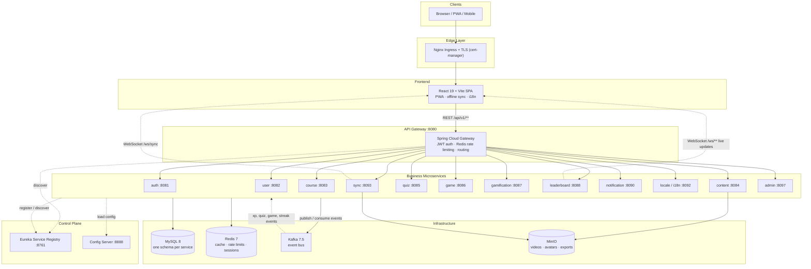

# Acadevia — Gamified Multilingual Learning Platform

**Acadevia** is a gamified, multilingual, offline-capable e-learning platform for Indian K-12 students, built as a full microservices system: **13 Spring Boot services**, a **React 19 PWA frontend**, and a production-grade infrastructure layer (MySQL 8, Redis 7, Kafka, MinIO) with Docker, Kubernetes, CI/CD and observability baked in.

Students learn through courses, video content, quizzes and educational games, earning **XP, badges, streaks and levels** while competing on **live leaderboards**. Teachers get classroom analytics, administrators get a content/console surface, and the whole UI ships in multiple Indian languages and scripts — with offline sync for low-connectivity environments.

---

## Table of Contents

- [What is Acadevia?](#what-is-acadevia)
- [System Architecture](#system-architecture)
- [Microservices](#microservices)
- [Infrastructure Stack](#infrastructure-stack)
- [Repository Layout](#repository-layout)
- [Quick Start](#quick-start)
- [Port Reference](#port-reference)
- [API Surface (API Gateway routes)](#api-surface-api-gateway-routes)
- [Configuration & Secrets](#configuration--secrets)
- [Testing](#testing)
- [Observability](#observability)
- [Deployment & CI/CD](#deployment--cicd)
- [Further Documentation](#further-documentation)
- [Contributing](#contributing)

---

## What is Acadevia?

| Audience | What they get |
|----------|---------------|
| **Students** | Courses & lessons, streamed video content, quizzes with attempts and grading, educational games (including multiplayer sessions), XP / badges / streaks / levels, live daily-weekly-monthly leaderboards, notifications, multi-language UI, offline mode with background sync (PWA) |
| **Teachers** | Classroom rosters, per-student and per-subject analytics, quiz authoring and management |
| **Admins** | Content and user administration, platform operations console |
| **Platform teams** | Event-driven microservices, centralized config & service discovery, rate limiting & JWT at the edge, Prometheus/Grafana/Loki/Jaeger observability, Kubernetes manifests, CI/CD pipelines, backup & disaster-recovery runbooks |

Key product characteristics:

- **Gamification core** — XP events flow over Kafka (`xp.earned`, `badge.unlocked`, `level.changed`, `streak.updated`) and drive leaderboards in near real time over WebSockets.
- **India-first i18n** — `locale-service` supports Devanagari, Tamil, Telugu, Bengali, Gujarati, Kannada, Malayalam, Gurmukhi, Odia, Nastaliq, Latin, Meetei Mayek and Ol Chiki scripts with a configurable fallback chain.
- **Offline-first frontend** — Vite PWA with Workbox caching, Dexie (IndexedDB) local state and `sync-service` conflict resolution (`last-write-wins`, chunked downloads).
- **Database-per-service** — every service owns its MySQL schema; cross-service consistency is achieved with Kafka events, not shared tables.

---

## System Architecture



Quick terminal view:

```
 Browser/PWA ──> Nginx ──> React SPA ──> API Gateway (:8080)
                                            │  JWT + rate limiting + discovery
        ┌───────────┬───────────┬───────────┼───────────┬───────────┐
      auth        user        course      quiz        game     leaderboard ...
        │           │           │           │           │           │
        └───────────┴─────┬─────┴───────────┴─────┬─────┴───────────┘
                          ▼                       ▼
                    MySQL 8 (per-service)   Kafka 7.5 (events)
                          ▼                       ▼
                     Redis 7 (cache)        MinIO (objects)
```

### Architectural patterns in use

| Pattern | Where |
|---------|-------|
| **API Gateway** | `api-gateway` (Spring Cloud Gateway): single entry point, route predicates per service, `JwtAuthenticationFilter`, Redis-backed `RequestRateLimiter` |
| **Service Discovery** | `service-registry` (Netflix Eureka, standalone mode); all services register with `lb://` lookups from the gateway |
| **Centralized Config** | `config-server` (Spring Config Server, `native` profile, classpath `configurations/`); services use `spring.config.import: optional:configserver:http://localhost:8888` |
| **Event-driven communication** | Kafka topics such as `user.registered`, `course.enrolled`, `quiz.completed`, `game.score-submitted`, `xp.earned`, `badge.unlocked`, `streak.updated` (see `acadevia-infrastructure/docker/infra/kafka/create-topics.sh`) |
| **Cache-aside & rate limiting** | Redis 7 — language packs, leaderboard pages, user display cache; gateway token-bucket rate limits per user key |
| **Database-per-service** | 13 isolated MySQL schemas; Flyway migrations in services that need strict versioning (`auth`, `course`, `game`, …), Hibernate `validate`/`update` elsewhere |
| **Object storage** | MinIO (S3 API) buckets: `acadevia-content`, `acadevia-avatars`, `acadevia-exports`; ranged streaming for video |
| **Realtime push** | WebSockets through the gateway (`/ws/**`) for live leaderboards and sync progress |
| **Offline-first PWA** | Workbox runtime caching + Dexie IndexedDB store + `sync-service` batched sync with `last-write-wins` conflict strategy |

---

## Microservices

| Service | Module | Port | Gateway route(s) | Responsibility | MySQL schema |
|---------|--------|------|------------------|----------------|--------------|
| API Gateway | `api-gateway` | 8080 | `/api/v1/**`, `/ws/**` | Routing, JWT validation, rate limiting | — |
| Auth | `auth-service` | 8081 | `/api/v1/auth/**` | Register/login, JWT access + refresh tokens, password change | `acadevia_auth` |
| User | `user-service` | 8082 | `/api/v1/users/**`, `/geography/**`, `/schools/**`, `/classrooms/**` | Profiles, roles, schools & classrooms, geography data | `acadevia_user` |
| Course | `course-service` | 8083 | `/api/v1/courses/**`, `/enrollments/**`, `/lessons/**`, `/progress/**` | Course catalogue, enrolment, lesson progress | `acadevia_course` |
| Content | `content-service` | 8084 | `/api/v1/content/**`, `/videos/**` | Content items, uploads, media processing, MinIO storage | `acadevia_content` |
| Quiz | `quiz-service` | 8085 | `/api/v1/quizzes/**`, `/attempts/**` | Quiz authoring, attempts, grading | `acadevia_quiz` |
| Game | `game-service` | 8086 | `/api/v1/games/**` | Educational games, multiplayer sessions (max 8 players), mastery rules | `acadevia_game` |
| Gamification | `gamification-service` | 8087 | `/api/v1/gamification/**` | XP ledger, badges, streaks, levels (consumes Kafka events) | `acadevia_gamification` |
| Leaderboard | `leaderboard-service` | 8088 | `/api/v1/leaderboard/**`, `/ws/**` | Rankings (daily/weekly/monthly with cron resets), snapshots, WebSocket fan-out, XP→coins | `acadevia_leaderboard` |
| Notification | `notification-service` | 8090 | `/api/v1/notifications/**` | In-app / email / push notification fan-out | `acadevia_notification` |
| Locale (i18n) | `locale-service` | 8092 | `/api/v1/i18n/**` | Translations, language packs, script support, cached lookups | `acadevia_locale` |
| Sync | `sync-service` | 8093 | `/api/v1/sync/**` | Offline sync batches, conflict resolution, chunked content downloads | `acadevia_sync` |
| Admin | `admin-service` | 8097 | `/api/v1/admin/**` | Administration operations console backend | `acadevia_admin` |
| Config Server | `config-server` | 8888 | — (internal) | Centralized configuration (native profile) | — |
| Service Registry | `service-registry` | 8761 | — (internal) | Eureka discovery server | — |

> **Notes**
> - `locale-service` is packaged/deployed under the image & route name **`i18n-service`** in Docker/Kubernetes manifests.
> - An **`analytics-service`** is routed by the gateway (`/api/v1/analytics/**`) and has Docker/K8s manifests, but its source module is not part of this monorepo yet.
> - Services with a `servlet.context-path` (leaderboard, notification, locale, sync, admin) expose actuator & swagger under that prefix when called directly; via the gateway always use the routes above.

---

## Infrastructure Stack

| Component | Version / Image | Local address | Purpose |
|-----------|-----------------|---------------|---------|
| MySQL | 8.0 | `localhost:3307` → container 3306 | Relational storage, one schema per service (init scripts create schemas, users, grants) |
| Redis | 7 | `localhost:6379` | Caching, gateway rate-limiter store, leaderboard hot paths |
| Kafka (+ Zookeeper) | Confluent 7.5 | `localhost:9092` (host), `kafka:29092` (in-network) | Event bus; topics auto-created by `kafka-init` container |
| Kafka UI | — | `localhost:8180` | Topic/consumer inspection |
| MinIO | — | API `localhost:9000`, console `localhost:9001` (`minioadmin`/`minioadmin`) | S3-compatible object storage + CDN origin |
| Nginx | — | edge configs in `acadevia-infrastructure/docker/infra/nginx/` | Ingress, CDN proxy, WebSocket upgrade rules |
| Prometheus / Grafana / Loki / Promtail / Jaeger | — | see `docker-compose.monitoring.yml` | Metrics, dashboards, log aggregation, tracing |

**Event bus (selected topics):** `user.registered`, `user.logged-in`, `course.created`, `course.enrolled`, `course.completed`, `lesson.completed`, `content.uploaded`, `content.processed`, `quiz.created`, `quiz.attempted`, `quiz.completed`, `game.started`, `game.completed`, `game.score-submitted`, `xp.earned`, `xp.updated`, `badge.unlocked`, `level.changed`, `streak.updated` — full list in `acadevia-infrastructure/docker/infra/kafka/create-topics.sh`.

---

## Repository Layout

```
.
├── api-gateway/               # Spring Cloud Gateway: routes, JWT filter, rate limiting
├── config-server/             # Centralized config (native profile)
├── service-registry/          # Eureka discovery server
├── auth-service/              # Authentication & JWT issuance
├── user-service/              # Users, schools, classrooms, geography
├── course-service/            # Courses, enrolments, lessons, progress
├── content-service/           # Content items & media processing
├── quiz-service/              # Quizzes & attempts
├── game-service/              # Educational games & multiplayer sessions
├── gamification-service/      # XP, badges, streaks, levels
├── leaderboard-service/       # Rankings, resets, WebSocket fan-out
├── notification-service/      # Notification fan-out
├── locale-service/            # i18n / language packs (deployed as i18n-service)
├── sync-service/              # Offline sync & content distribution
├── admin-service/             # Admin operations
├── acadevia-frontend/         # React 19 + Vite PWA (students, teachers, admin UIs)
│   └── src/                   #   pages/{student,teacher,admin,public}, stores, services, sw/
├── acadevia-infrastructure/   # Everything needed to run & ship the platform
│   ├── Makefile               #   `make dev`, `make test`, `make k8s-deploy-all`, …
│   ├── docker/                #   compose files (infra / services / monitoring / prod), .env
│   ├── kubernetes/            #   manifests: services, infra, monitoring, networking, jobs
│   ├── ci-cd/                 #   GitHub Actions workflows + Jenkinsfile
│   ├── scripts/               #   local-setup / build / deploy / backup helpers
│   └── docs/                  #   architecture, deployment, monitoring, DR, runbook
├── docker/                    # Lightweight alternative compose stack (infra + core services)
└── pom.xml                    # Maven aggregator (Java 17, Spring Boot 3.2.3, Spring Cloud 2023.0.0)
```

---

## Quick Start

### Prerequisites

| Software | Version | Check |
|----------|---------|-------|
| Docker + Compose v2 | 24+ / v2 | `docker --version && docker compose version` |
| JDK | 17 | `java -version` |
| Maven | 3.9+ | `mvn -version` |
| Node.js | 20 LTS | `node --version` |

Recommended machine: 16 GB RAM (8 GB minimum), 4+ CPUs for Docker, ~20 GB free disk.

### Option 1 — Full stack in Docker (recommended)

```bash
git clone https://github.com/Saadmadni84/Acadevia-Final.git
cd Acadevia-Final/acadevia-infrastructure

make dev          # brings up infra (MySQL, Redis, Kafka, MinIO) then all services + frontend
make dev-logs     # follow logs
make dev-stop     # stop everything
make dev-reset    # stop and wipe volumes (fresh databases)
```

Equivalent without make: `./scripts/local-setup.sh`, or manually
`cd docker && docker compose -f docker-compose.infra.yml up -d && docker compose up -d`.

Once healthy:

| URL | What |
|-----|------|
| http://localhost:3000 | Frontend (React PWA, served by nginx) |
| http://localhost:8080 | API Gateway (all `/api/v1/**` routes) |
| http://localhost:8761 | Eureka dashboard |
| http://localhost:8180 | Kafka UI |
| http://localhost:9001 | MinIO console (`minioadmin` / `minioadmin`) |
| `localhost:3307` | MySQL (user `root`, password from `docker/.env`) |

### Option 2 — Infrastructure in Docker, services on your JVM (normal dev loop)

```bash
# 1. Infra only
cd acadevia-infrastructure && make dev-infra

# 2. Build backend
cd .. && mvn clean install -DskipTests

# 3. Start services in this order (each in its own terminal, or your IDE):
#    service-registry → config-server → api-gateway → any business service
mvn -pl service-registry spring-boot:run
mvn -pl config-server   spring-boot:run
mvn -pl api-gateway     spring-boot:run
mvn -pl auth-service    spring-boot:run   # …and whichever service you are working on

# 4. Frontend
cd acadevia-frontend
npm ci
npm run dev        # http://localhost:5173 — proxies /api → http://localhost:8080
```

### Option 3 — Frontend only (no backend at all)

The Vite dev server embeds a mock API layer (`acadevia-frontend/src/scripts/databaseApi.cjs`) that serves the core `/api/v1/**` endpoints (state, quizzes, attempts, leaderboard, content, users, teacher analytics, uploads with video range-streaming) from a local file-backed store. So:

```bash
cd acadevia-frontend && npm ci && npm run dev
```

…gives you a fully explorable UI at http://localhost:5173 with zero backend running. Any `/api` path the mock doesn't implement is proxied to the gateway if it is up.

### Lightweight alternative stack

`docker/docker-compose.yml` (repo root) runs a smaller footprint: MySQL (3307), Redis, Zookeeper/Kafka, Zipkin (9411), Prometheus (9090), Grafana (3001), Adminer, plus registry/config/gateway/auth/user services. Handy for gateway + auth experiments. (Note: it maps Adminer to host port 8082 — stop it if you run `user-service` locally on 8082.)

### Seeded data & simulation

- `docker/init-scripts/init-databases.sql` creates the `_db` schemas for the lightweight stack; `acadevia-infrastructure/docker/infra/mysql/init/*.sql` create schemas/users/grants for the full stack.
- `docker/init-scripts/seed_class10_simulation_attempts.sql` seeds Class-10 quiz attempts; the matching frontend simulation test runs with `npm run simulate:class10` inside `acadevia-frontend`.

---

## Port Reference

| Port | Component |
|------|-----------|
| 3000 | Frontend container (nginx) — full Docker stack |
| 5173 | Vite dev server (local frontend dev) |
| 8080 | API Gateway |
| 8081 | auth-service |
| 8082 | user-service |
| 8083 | course-service |
| 8084 | content-service |
| 8085 | quiz-service |
| 8086 | game-service |
| 8087 | gamification-service |
| 8088 | leaderboard-service (context `/api/leaderboard`) |
| 8090 | notification-service (context `/api/notifications`) |
| 8092 | locale-service / i18n (context `/api/locale`) |
| 8093 | sync-service (context `/sync`) |
| 8097 | admin-service (context `/api/admin`) |
| 8761 | Eureka service registry |
| 8888 | Config server |
| 8180 | Kafka UI |
| 3307 → 3306 | MySQL (host → container) |
| 6379 | Redis |
| 9092 / 29092 | Kafka (host / in-network) |
| 2181 | Zookeeper |
| 9000 / 9001 | MinIO API / console |
| 9411 | Zipkin (lightweight stack) |
| 9090 / 3001 | Prometheus / Grafana (lightweight stack) |

---

## API Surface (API Gateway routes)

All client traffic enters through `http://localhost:8080`. Every route below passes the Redis token-bucket **rate limiter** and (except WebSocket upgrades) the **JWT authentication filter**:

| Route prefix | Routed to |
|--------------|-----------|
| `/api/v1/auth/**` | auth-service |
| `/api/v1/users/**`, `/api/v1/geography/**`, `/api/v1/schools/**`, `/api/v1/classrooms/**` | user-service |
| `/api/v1/courses/**`, `/api/v1/enrollments/**`, `/api/v1/lessons/**`, `/api/v1/progress/**` | course-service |
| `/api/v1/content/**`, `/api/v1/videos/**` | content-service |
| `/api/v1/quizzes/**`, `/api/v1/attempts/**` | quiz-service |
| `/api/v1/games/**` | game-service |
| `/api/v1/gamification/**` | gamification-service |
| `/api/v1/leaderboard/**` | leaderboard-service |
| `/ws/**` | leaderboard-service (WebSocket) |
| `/api/v1/notifications/**` | notification-service |
| `/api/v1/analytics/**` | analytics-service (manifest-only, see notes) |
| `/api/v1/admin/**` | admin-service |
| `/api/v1/i18n/**` | i18n / locale-service |
| `/api/v1/sync/**` | sync-service |

Services also expose Swagger UI when called directly (e.g. `http://localhost:8088/api/leaderboard/swagger-ui.html`) and actuator endpoints (`/actuator/health`, `/actuator/metrics`, `/actuator/prometheus`).

---

## Configuration & Secrets

- **Environment defaults** live in `acadevia-infrastructure/docker/.env` (and `.env.prod`): per-service DB names/users/passwords, Redis, Kafka bootstrap servers, JWT secret & expiries, MinIO keys/buckets, CDN base URL, SMTP/SMS/FCM placeholders, image registry & tag.
- **Centralized overrides** come from `config-server` (native profile, classpath `configurations/`); services tolerate its absence via `optional:configserver:` imports, so local runs fall back to their bundled `application.yml`.
- **Commonly tweaked variables**: `JWT_SECRET`, `DB_USERNAME`/`DB_PASSWORD`, `REDIS_HOST`/`REDIS_PORT`/`REDIS_PASSWORD`, `KAFKA_SERVERS`, `EUREKA_URL`, `AWS_ACCESS_KEY`/`AWS_SECRET_KEY` (MinIO/S3), `VITE_API_BASE_URL`, `VITE_SOCKET_URL`.
- **Production hygiene**: `acadevia-infrastructure/scripts/generate-secrets.sh` creates strong secrets; `kubernetes/secret-common.yml` + `scripts/apply-secrets.sh` wire them into K8s. Never commit real credentials — the values in `.env` are local-development only.

---

## Testing

```bash
# Backend (all modules)
mvn test
mvn -pl quiz-service test          # single module

# Frontend unit/component tests (Vitest + jsdom)
cd acadevia-frontend && npm test

# Class-10 live simulation test
npm run simulate:class10

# End-to-end (Playwright)
npx playwright test                # config: acadevia-frontend/playwright.config.ts

# Make shortcuts
cd acadevia-infrastructure
make test            # backend suite
make test-frontend   # frontend suite
make test-e2e        # Playwright
make test-coverage   # coverage reports
```

---

## Observability

```bash
cd acadevia-infrastructure && make monitoring-up     # Prometheus + Grafana + Loki + Promtail + Jaeger
```

- **Metrics**: every service exposes `/actuator/prometheus`; Prometheus scrapes them (`docker/monitoring/prometheus/prometheus.yml`) with alert rules in `alert-rules.yml`.
- **Dashboards**: pre-provisioned Grafana dashboards for JVM, infrastructure, MySQL, Redis, Kafka, API gateway and business KPIs (`docker/monitoring/grafana/dashboards/`).
- **Logs**: Promtail → Loki, explored in Grafana.
- **Traces**: Jaeger (Zipkin-compatible endpoints in services).
- **Health**: `make health` / `scripts/health-check.sh` probes the whole stack.

---

## Deployment & CI/CD

| Target | How |
|--------|-----|
| **Docker (prod-like)** | `acadevia-infrastructure/docker/docker-compose.prod.yml` + `.env.prod` |
| **Kubernetes** | `acadevia-infrastructure/kubernetes/` — namespace, infra StatefulSets (MySQL, Redis, Kafka, Zookeeper, MinIO), per-service Deployments + Services + HPAs, ingress + cert-manager, network policies, jobs (migrations, topic creation, cache warmup, DB backup cron), monitoring stack. Scripts: `deploy-all.sh`, `deploy-service.sh`, `rollback-service.sh`, `scale-service.sh`, `view-logs.sh` |
| **Make shortcuts** | `make k8s-deploy-all`, `make deploy-staging`, `make deploy-production`, `make db-backup`, `make db-restore` |
| **CI/CD** | GitHub Actions in `acadevia-infrastructure/ci-cd/.github/workflows/`: `ci.yml`, `frontend-ci.yml`, `cd-staging.yml`, `cd-production.yml`, `security-scan.yml`, `db-backup.yml`; plus a `Jenkinsfile` alternative |

Operational depth lives in the docs folder — see below.

---

## Further Documentation

| Document | Contents |
|----------|----------|
| [`acadevia-infrastructure/docs/architecture.md`](acadevia-infrastructure/docs/architecture.md) | Deep-dive architecture, communication patterns, security layers, deployment topology |
| [`acadevia-infrastructure/docs/local-development.md`](acadevia-infrastructure/docs/local-development.md) | Step-by-step local setup, hot reload, debugging, common issues |
| [`acadevia-infrastructure/docs/deployment-guide.md`](acadevia-infrastructure/docs/deployment-guide.md) | Staging/production deployment walkthrough |
| [`acadevia-infrastructure/docs/monitoring-guide.md`](acadevia-infrastructure/docs/monitoring-guide.md) | Metrics, dashboards, alerts, tracing |
| [`acadevia-infrastructure/docs/runbook.md`](acadevia-infrastructure/docs/runbook.md) | Day-2 operations runbook |
| [`acadevia-infrastructure/docs/disaster-recovery.md`](acadevia-infrastructure/docs/disaster-recovery.md) | Backup/restore and DR procedures |

---

## Contributing

1. Create a personal or topic branch from `main` (the repo convention is personal branches, e.g. `saad-madni`, `alokvishwas`, or topic branches like `fix/class-grade-validation`).
2. Commit with your real name and email so attribution stays clean.
3. Open a pull request against `main`; PRs are reviewed and merged there (see existing PRs for format).
4. Keep infrastructure changes accompanied by updates in `acadevia-infrastructure/docs/`.

---

*Built by the Acadevia team — Java 17 · Spring Boot 3.2 · Spring Cloud 2023.0 · React 19 · Vite · MySQL 8 · Redis 7 · Kafka 7.5 · MinIO · Kubernetes.*
