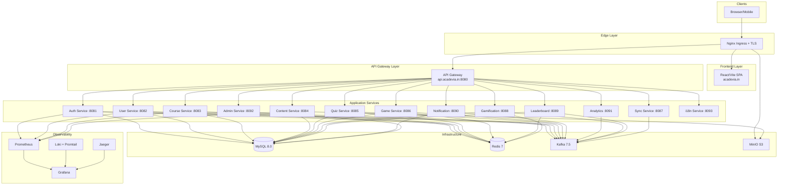

# Acadevia Platform — System Architecture

> **Version:** 1.0 | **Last Updated:** February 2026 | **Stack:** Java 17, Spring Boot 3.2, React/Vite, MySQL 8, Redis 7, Kafka 7.5, MinIO

---

## Table of Contents

- [High-Level Architecture](#high-level-architecture)
- [Architecture Diagram](#architecture-diagram)
- [Microservices Overview](#microservices-overview)
- [Infrastructure Services](#infrastructure-services)
- [Communication Patterns](#communication-patterns)
- [Data Flow](#data-flow)
- [Service Discovery & Routing](#service-discovery--routing)
- [Security Layers](#security-layers)
- [Monitoring Stack](#monitoring-stack)
- [Deployment Topology](#deployment-topology)

---

## High-Level Architecture

Acadevia is a **microservices-based e-learning platform** with 14 backend Spring Boot services, a React frontend, and supporting infrastructure. The system follows an **API Gateway pattern** with event-driven communication via Kafka and caching through Redis.

```
┌─────────────────────────────────────────────────────────────────────────┐
│                          CLIENTS                                        │
│            Browser / Mobile App / API Consumers                         │
└───────────────────────────────┬─────────────────────────────────────────┘
                                │
                                ▼
┌─────────────────────────────────────────────────────────────────────────┐
│                     EDGE / INGRESS LAYER                                │
│         Nginx Ingress Controller + cert-manager (Let's Encrypt)         │
│   ┌─────────────┐  ┌──────────────────┐  ┌──────────────┐              │
│   │ acadevia.in │  │ api.acadevia.in  │  │cdn.acadevia.in│             │
│   │ (Frontend)  │  │ (API Gateway)    │  │ (MinIO/CDN)  │              │
│   └─────────────┘  └──────────────────┘  └──────────────┘              │
└───────────────────────────────┬─────────────────────────────────────────┘
                                │
            ┌───────────────────┼───────────────────┐
            ▼                   ▼                   ▼
┌───────────────────┐ ┌─────────────────┐ ┌─────────────────┐
│    Frontend       │ │  API Gateway    │ │     MinIO       │
│  (React/Vite)     │ │  (Spring Cloud) │ │ (Object Storage)│
│  Port: 80         │ │  Port: 8080     │ │  Port: 9000     │
└───────────────────┘ └────────┬────────┘ └─────────────────┘
                               │
          ┌────────────────────┼────────────────────┐
          ▼                    ▼                    ▼
┌──────────────────────────────────────────────────────────────┐
│                    APPLICATION SERVICES                       │
│  ┌──────────┐ ┌──────────┐ ┌──────────┐ ┌──────────────┐   │
│  │  Auth    │ │  User    │ │  Course  │ │   Content    │   │
│  │  :8081   │ │  :8082   │ │  :8083   │ │   :8084      │   │
│  ├──────────┤ ├──────────┤ ├──────────┤ ├──────────────┤   │
│  │  Quiz    │ │  Game    │ │  Sync    │ │ Gamification │   │
│  │  :8085   │ │  :8086   │ │  :8087   │ │   :8088      │   │
│  ├──────────┤ ├──────────┤ ├──────────┤ ├──────────────┤   │
│  │Leaderbd  │ │ Notif.   │ │Analytics │ │   Admin      │   │
│  │  :8089   │ │  :8090   │ │  :8091   │ │   :8092      │   │
│  ├──────────┤ ├──────────┤                               │
│  │  i18n    │ │ Config   │                               │
│  │  :8093   │ │ Server   │                               │
│  └──────────┘ └──────────┘                               │
└──────────────────────┬───────────────────────────────────────┘
                       │
┌──────────────────────┼───────────────────────────────────────┐
│                 INFRASTRUCTURE LAYER                          │
│  ┌──────────┐  ┌──────────┐  ┌──────────┐  ┌──────────┐    │
│  │ MySQL 8  │  │ Redis 7  │  │ Kafka    │  │  MinIO   │    │
│  │ :3306    │  │ :6379    │  │ :9092    │  │  :9000   │    │
│  │ 2GB RAM  │  │ 512MB    │  │ 1GB RAM  │  │          │    │
│  └──────────┘  └──────────┘  └──────────┘  └──────────┘    │
└──────────────────────────────────────────────────────────────┘
```

---

## Architecture Diagram



---

## Microservices Overview

| Service | Port | Responsibility | Key Dependencies |
|---------|------|----------------|------------------|
| **Config Server** | — | Centralized configuration management for all services | Git repo/filesystem |
| **Service Registry** | — | Eureka-based service registration and discovery | — |
| **API Gateway** | 8080 | Request routing, rate limiting, JWT validation, CORS, load balancing | Redis, all services |
| **Auth Service** | 8081 | Authentication (login/register), JWT token issuing/refresh, OAuth2 | MySQL, Redis, Kafka |
| **User Service** | 8082 | User profiles, preferences, account management, avatar uploads | MySQL, Redis, Kafka |
| **Course Service** | 8083 | Course CRUD, curriculum management, enrollment, lessons, modules | MySQL, Redis, Kafka |
| **Content Service** | 8084 | Media upload/processing, file management, CDN integration | MySQL, Redis, Kafka, MinIO |
| **Quiz Service** | 8085 | Quiz creation, question banks, quiz attempts, grading | MySQL, Redis, Kafka |
| **Game Service** | 8086 | Interactive game logic, game sessions, educational games | MySQL, Redis, Kafka |
| **Sync Service** | 8087 | Offline data synchronization, conflict resolution | MySQL, Redis, Kafka |
| **Gamification Service** | 8088 | Points, badges, achievements, streaks, rewards engine | MySQL, Redis, Kafka |
| **Leaderboard Service** | 8089 | Rankings, leaderboard computation, periodic aggregation | MySQL, Redis, Kafka |
| **Notification Service** | 8090 | Email (SMTP), SMS, push notifications (FCM), in-app notifications | MySQL, Redis, Kafka |
| **Analytics Service** | 8091 | Learning analytics, progress tracking, usage metrics, reporting | MySQL, Redis, Kafka |
| **Admin Service** | 8092 | Administrative dashboard, user management, system configuration | MySQL, Redis, Kafka |
| **i18n Service** | 8093 | Internationalization, translation management, locale resolution | MySQL, Redis, Kafka |
| **Frontend** | 3000 (80) | React SPA with Vite, Tailwind CSS, React Router, i18n support | API Gateway |

---

## Infrastructure Services

### MySQL 8.0
- **Purpose:** Primary relational datastore for all microservices
- **Configuration:** Custom `my.cnf`, InnoDB engine, UTF8MB4 charset
- **Databases:** Each service has its own database (database-per-service pattern)
  - `acadevia_auth`, `acadevia_users`, `acadevia_courses`, `acadevia_content`, `acadevia_quiz`, `acadevia_gamification`, `acadevia_notifications`, `acadevia_admin`, `acadevia_leaderboard`, `acadevia_locale`, `acadevia_sync`
- **Resources:** 2GB RAM (dev), 4GB RAM (prod)
- **Backups:** Daily via CronJob, uploaded to MinIO/S3

### Redis 7 Alpine
- **Purpose:** Caching, session storage, rate limiting, leaderboard sorted sets
- **Configuration:** Custom `redis.conf`, persistence via RDB/AOF
- **Resources:** 512MB (dev), 1GB (prod)
- **Key patterns:** `auth:session:*`, `cache:course:*`, `rate:*`, `leaderboard:*`

### Apache Kafka (Confluent 7.5)
- **Purpose:** Asynchronous event streaming between services
- **Configuration:** Single broker (dev), configurable replication (prod)
- **Key topics:**
  - `user.registered`, `user.updated`, `user.deleted`
  - `course.created`, `course.enrolled`, `course.completed`
  - `quiz.submitted`, `quiz.graded`
  - `gamification.points-earned`, `gamification.badge-awarded`
  - `notification.send`, `notification.email`, `notification.push`
  - `analytics.event`
- **Dependencies:** Zookeeper (port 2181)
- **Resources:** 1GB (dev), 2GB (prod)

### MinIO (S3-Compatible Object Storage)
- **Purpose:** File storage for course content, user avatars, exports
- **Buckets:** `content`, `avatars`, `exports`
- **Access:** Via S3-compatible API, CDN fronted in production
- **Console:** Port 9001

---

## Communication Patterns

### Synchronous Communication (REST via API Gateway)
All client-facing requests flow through the API Gateway:

```
Client → Nginx Ingress → API Gateway → Target Service → Response
```

- **Protocol:** HTTP/HTTPS with JSON payloads
- **Authentication:** JWT Bearer tokens validated at the gateway
- **Rate Limiting:** Configurable per-endpoint via Redis-backed counters
- **Timeouts:** read=3600s, send=3600s (configurable at ingress)
- **Retry Policy:** Automatic retries with exponential backoff

### Asynchronous Communication (Kafka Events)
Services publish domain events to Kafka topics for decoupled processing:

```
Service A → Kafka Topic → Service B (Consumer Group)
                       → Service C (Consumer Group)
```

**Example flows:**
1. **User Registration:** Auth Service → `user.registered` → Notification Service (welcome email) + Analytics Service (tracking)
2. **Course Enrollment:** Course Service → `course.enrolled` → Gamification Service (award points) + Notification Service (confirmation)
3. **Quiz Completion:** Quiz Service → `quiz.graded` → Gamification Service (update XP) + Leaderboard Service (recalculate rank)

### WebSocket Communication
- Sync Service provides real-time data synchronization via WebSocket
- Exposed through API Gateway at `/ws/` path

---

## Data Flow

### Typical Request Flow

```
1. User opens browser → acadevia.in
2. Browser loads React SPA from Nginx/Frontend container
3. User authenticates → POST api.acadevia.in/api/auth/login
4. Nginx Ingress terminates TLS
5. Request routed to API Gateway (port 8080)
6. Gateway validates JWT, applies rate limiting (Redis)
7. Gateway routes to Auth Service (port 8081)
8. Auth Service queries MySQL (acadevia_auth database)
9. Auth Service issues JWT, publishes to Kafka (user.authenticated)
10. Response flows back: Auth → Gateway → Nginx → Browser
11. Kafka event consumed by Analytics Service (login tracking)
```

### Event-Driven Data Flow

```
┌──────────┐    event     ┌──────────┐    event     ┌──────────┐
│ Course   │──────────────│  Kafka   │──────────────│ Gamific. │
│ Service  │  course.     │  Broker  │  course.     │ Service  │
│          │  completed   │          │  completed   │          │
└──────────┘              └────┬─────┘              └──────────┘
                               │
                               │ course.completed
                               ▼
                          ┌──────────┐
                          │ Notif.   │
                          │ Service  │
                          └──────────┘
```

---

## Service Discovery & Routing

### Development (Docker Compose)
- Services communicate via Docker network (`acadevia-network`) using container names
- API Gateway routes via internal DNS: `http://auth-service:8081`
- All services registered on the `acadevia-network` bridge network

### Production (Kubernetes)
- **Namespace:** `acadevia`
- **Service Discovery:** Kubernetes DNS (`<service>.<namespace>.svc.cluster.local`)
- **Ingress:** Nginx Ingress Controller with TLS termination
- **Config Server:** Centralized Spring Cloud Config for environment-specific properties
- **Service Registry:** Eureka for Spring-based service registration (optional with K8s DNS)

### DNS Layout

| Subdomain | Target |
|-----------|--------|
| `acadevia.in` | Frontend (React SPA) |
| `api.acadevia.in` | API Gateway |
| `cdn.acadevia.in` | MinIO object storage |
| `grafana.acadevia.in` | Grafana dashboards |

---

## Security Layers

### Layer 1: Edge Security
- **TLS Termination:** Let's Encrypt certificates via cert-manager
- **Rate Limiting:** 100 RPS per IP with 5x burst multiplier (Nginx Ingress)
- **CORS:** Restricted to `https://acadevia.in`
- **Request Size Limit:** 500MB (for file uploads)

### Layer 2: API Gateway
- **JWT Validation:** All `/api/**` requests validated for Bearer token
- **Route-Level Authorization:** Role-based access (STUDENT, TEACHER, ADMIN)
- **Request/Response Logging:** Sanitized audit logs

### Layer 3: Service-Level
- **Spring Security:** Each service enforces method-level security
- **Database Isolation:** Database-per-service with dedicated credentials
- **Secrets Management:** Kubernetes Secrets for production, `.env` for development

### Layer 4: Network Security
- **Network Policies:** Kubernetes NetworkPolicy restricts inter-service traffic
- **Internal-only ports:** Application services not exposed externally (only via Gateway)
- **Docker Network:** Bridge network isolation in development

### Layer 5: Data Security
- **Encryption at Rest:** MySQL InnoDB tablespace encryption (prod)
- **Password Hashing:** BCrypt with configurable work factor
- **JWT:** HMAC-SHA256 signed tokens with configurable expiry

---

## Monitoring Stack

| Component | Version | Purpose | Port |
|-----------|---------|---------|------|
| **Prometheus** | v2.48.0 | Metrics collection and alerting | 9090 |
| **Grafana** | v10.2.0 | Dashboard visualization | 3001 |
| **Loki** | v2.9.0 | Log aggregation | 3100 |
| **Promtail** | v2.9.0 | Log shipping agent | — |
| **Jaeger** | v1.52 | Distributed tracing (OpenTelemetry) | 16686 |

### Metrics Pipeline
```
Spring Boot Actuator → Prometheus scrape (15s interval) → Grafana dashboards
```

### Logging Pipeline
```
Service stdout → Docker JSON log driver → Promtail → Loki → Grafana
```

### Tracing Pipeline
```
Spring Boot (OpenTelemetry SDK) → Jaeger Collector (OTLP) → Jaeger UI
```

**Retention:** Prometheus retains 15 days of metrics data.

---

## Deployment Topology

### Development
- Docker Compose (3 compose files: `infra`, `main`, `monitoring`)
- Single-node, all services on `localhost`
- Hot reload for frontend (Vite HMR), manual restart for backend

### Staging
- Kubernetes cluster (same K8s manifests as production)
- Image tag: `staging`
- Scaled-down replicas
- Let's Encrypt staging certificates

### Production
- Kubernetes cluster with namespace `acadevia`
- Image tag: `production`
- 2 replicas per service (1 for admin/i18n)
- HPA (Horizontal Pod Autoscaler) enabled
- Cluster Autoscaler for node scaling
- Resource limits/reservations enforced
- Daily database backups to MinIO/S3
- 15-day metric retention, log rotation

---

## Technology Summary

| Layer | Technology | Version |
|-------|-----------|---------|
| Language | Java | 17 |
| Framework | Spring Boot | 3.2.3 |
| Cloud Framework | Spring Cloud | 2023.0.0 |
| Frontend | React + TypeScript + Vite | — |
| CSS | Tailwind CSS | — |
| Database | MySQL | 8.0 |
| Cache | Redis | 7 (Alpine) |
| Message Broker | Apache Kafka (Confluent) | 7.5.0 |
| Object Storage | MinIO | latest |
| Build Tool | Maven | 3.9+ |
| Container | Docker | 24+ |
| Orchestration | Kubernetes | 1.28+ |
| CI/CD | Jenkins | Pipeline |
| Monitoring | Prometheus + Grafana + Loki + Jaeger | — |
| TLS | cert-manager + Let's Encrypt | — |
| Ingress | Nginx Ingress Controller | — |
